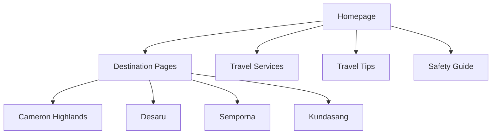

# MYEXPLORE — Malaysia Travel Website

A responsive front-end travel website that introduces Malaysian destinations, travel services, and travel information.

## Overview

MYEXPLORE is a static travel-website concept developed with HTML, CSS, JavaScript, Bootstrap, and image assets. It presents destinations and tourism-related services in Malaysia through a multi-page interface.

## Features

- Responsive travel-website layout
- Malaysia destination showcase pages
- Image galleries and carousels
- Travel-service information
- Travel tips and safety-guide content
- Multi-page navigation
- Bootstrap-based UI components

## Site Structure

## Example Pages

| File | Description |
|---|---|
| `index.html` / `Home.html` | Homepage |
| `services.html` | Travel-services page |
| `safetyGuide.html` | Travel-safety guide |
| `Cameron.html`, `Desaru.html`, `semporna.html` | Destination pages |
| `images/` | Website image assets |

## How to Run

No installation is required.

1. Clone or download the repository.
2. Open `index.html` in a web browser.

For development, you can use the VS Code Live Server extension.

## Scope

This is a static front-end project. It does not include real bookings, user authentication, payment processing, live hotel or flight data, or backend database integration.

## Tech Stack

HTML · CSS · JavaScript · Bootstrap
